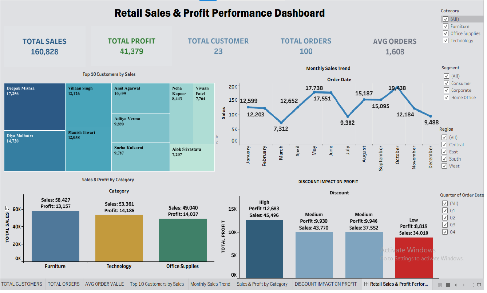

# Retail Sales & Profit Performance Analytics

## Overview
This project analyzes retail sales and profit data using SQL Server for data inspection, cleaning, updating, and analytical querying, followed by Tableau for interactive visualization.

## Dataset
Retail order data stored in a `Superstore_sql` table with the following fields:
`Order_ID`, `Order_Date`, `Customer_Name`, `Segment`, `Region`, `Category`, `Product_Name`, `Sales`, `Quantity`, `Discount`, `Profit`

## Tools
- **SQL Server** — data inspection, cleaning, updating, and analysis
- **Tableau** — dashboard development
- **Gamma** — presentation deck creation

*Note: This project's data cleaning and analysis were performed entirely in SQL Server — no Python scripting was used.*

## Steps
1. Retrieved and inspected the `Superstore_sql` table in SQL Server (`SELECT * FROM Superstore_sql`)
2. Inspected column names and data types via `INFORMATION_SCHEMA.COLUMNS`
3. Checked for null values using `SUM(CASE WHEN ... IS NULL THEN 1 ELSE 0 END)` logic
4. Updated missing values:
   - `Profit` set to `0` where `NULL`
   - `Customer_Name` set to `'Unknown'` where `NULL` or blank
5. Checked for duplicate `Order_ID` values using `GROUP BY` and `HAVING COUNT(*) > 1`
6. Ran aggregate and window-function queries for business-level summaries
7. Built an interactive Tableau dashboard with filters
8. Documented the workflow and findings in a written report
9. Created a summary presentation using Gamma

## Dashboard
A single-page Tableau dashboard including:
- **KPIs:** Total Sales, Total Profit, Total Customers, Total Orders, Avg Orders
- **Visuals:** Top 10 Customers by Sales (treemap), Monthly Sales Trend, Sales & Profit by Category, Discount Impact on Profit
- **Filters:** Category, Segment, Region, Quarter of Order Date

## Dashboard Preview

## Results
- Total Sales: **160,828** | Total Profit: **41,379** | 23 Customers | 100 Orders
- Deepak Mishra was the top customer by sales (**17,256**)
- Monthly sales ranged from 7,312 to 19,438, showing clear month-to-month variation
- Profit generally declined as discount levels increased

## How to Run
1. Load the retail order data into SQL Server as `Superstore_sql`
2. Run the provided SQL cleaning and analysis scripts
3. Connect Tableau to the SQL Server output and open the dashboard workbook (`.twbx`)
4. Refer to the PDF report and Gamma slides for the full SQL workflow and findings
